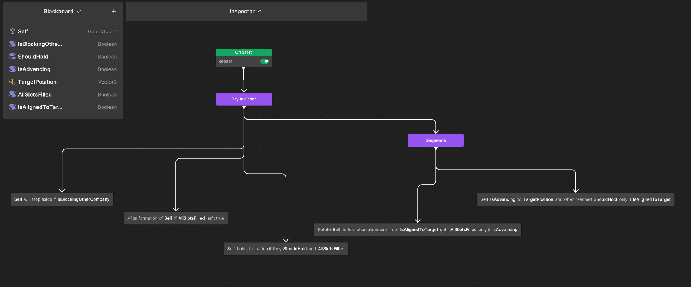

# Introduction
## Project Intro
The target of this project was to simulate Realistic Napoleonic War Formations, specifically those used 
within gunpowder warfare, using agents with individual logic that will help them to stay in formation, 
instead of static object groupings that is fully controlled.

Following the same hierarchy as during these periods, we can initially form agents into companies whereby
they will form the standard line formations of 20 soldiers in length and 3 in width, creating blocks of a 
total of 60 agents. These companies can then be formed into a battalion which conscists of 6 companies, 
every single battalion can now be set into their own formations of which the player has full control 
based on key inputs. Using these inputs, the user can easily have their battalion switch between these states
and the agents will follow a close approximation of the actual protocol used by each company to position
themselves for the battalion formation.

There are 3 formations that the user can have their battalion form. The line formation whereby 6 companies stand
in a row next to each other, this was a position commonly taken up for offensive situation. This allowed companies 
to not obstruct each other while performing a volley fire at the enemy.

The second formation is the column formation, a formation that ensures the mobility and maneauverability for the 
battalion and was often used to get from one point to another. The Formation is 2 companies in width and 3 in length, forming 
a pattern similar to that of the 6 face on a regular die. Using this formation the user can have the companies move
easily within the level.

The final formation is the square formation, the 6 companies take up a stationary position of 2 horizontal companies in width
and 1 vertical company, forming an empty square in the middle, used to protect highranking officials. This formation was often
taken up as a defensive measure against possible cavalry charges from the enemy. Ensuring that the soldiers can take up phalanx
positions as well as being able to return volley fire against incoming enemies. This formation was quite static, meaning there
are actually no real protocols for moving while in square formation. To reflect this, the user has to first set their battalion
to be in another formations before they can move them.

This project is made entirely in Unity 6 using Unity Behaviour Package (ver 1.0.9) as the corner stone for behaviour tree
logic of the companies. The research project itself is structured like a bare bone RTS game, whereby you can move the camera 
in the level and click-and-drag to select agents, companies and battalions.

## Motivation
I've long been fascinated by formation-based real-time tactics, especially in historical settings like the Napoleonic Wars.
Something that I've rarely seen effectively done within games, the only ones that really come to mind is Total War Napoleon and
Holdfast (which doesn't even use AI to simulate, relying on real players to follow instead).
The idea of scripting disciplined AI behavior that mimics battlefield maneuvers from the 1800s provided an excellent opportunity 
to combine behavior trees, blackboards, vector math, and AI coordination. This project demonstrates how Unity can simulate 
advanced formation logic beyond typical flocking or follow-leader systems.

# Design And Implementation
## Formation Types Visualization
Line Formation: Companies stand shoulder to shoulder, agents organized into a 3-line deep, 20-wide rectangle.


Column Formation: Companies are positioned in a 2-wide, 3-deep configuration.


Square Formation: Companies are assigned to the top, bottom, and side edges of a square, designed to reflect anti-cavalry tactics.


## Company Architecture
Each company contains:
1) 60 agents
2) Is controlled via a centralized CompanyController.
3) Companies use IssueControlledMarchToCompany to move to the new alignment in unison, and IssueMarchCommand for individual company movement.

## Movement Pipeline
The formation change system per battalion consists of several phases, the two primary ones are allignment phase whereby
we first make sure that all the battalions are properly alligned to move in, and movement phase whereby the company finally
moves into position. Here's an example of one specific for when a battalion is moving from line to square formation.

```C#
private void IssueLineToSquareFormation(BattalionController battalion, Vector3 formationRight, float sideOffset, float frontBackOffset)
{
    Vector3 lateral = formationRight.normalized;

    List<CompanyController> sorted = new List<CompanyController>(battalion.Companies);
    sorted.Sort((a, b) => a.transform.position.x.CompareTo(b.transform.position.x));

    if (sorted.Count < 6)
    {
        Debug.LogWarning("[BattalionCommander] Need at least 6 companies to form square from line.");
        return;
    }

    var topCompanies = new List<CompanyController> { sorted[0], sorted[5] }; // outer
    var bottomCompanies = new List<CompanyController> { sorted[1], sorted[4] }; // next inner
    var sideCompanies = new List<CompanyController> { sorted[2], sorted[3] }; // middle

    Vector3 center = battalion.GetAveragePosition();
    Vector3 forward = Vector3.Cross(Vector3.up, lateral).normalized;
    center -= forward * 60f; 

    Vector3 leftTarget = center - lateral * sideOffset;
    Vector3 rightTarget = center + lateral * sideOffset;
    Vector3 leftIntermediate = leftTarget - lateral * 30f;
    Vector3 rightIntermediate = rightTarget + lateral * 30f;

    sideCompanies[0].SetFormationRight(lateral);
    sideCompanies[1].SetFormationRight(lateral);
    IssueControlledMarchToCompany(sideCompanies[0], leftIntermediate, lateral);
    IssueControlledMarchToCompany(sideCompanies[1], rightIntermediate, lateral);

    StartCoroutine(WaitAndReissueFinalVerticalSquareTargets(
        sideCompanies[0], sideCompanies[1],
        leftTarget, rightTarget,
        sideOffset,
        topCompanies, bottomCompanies
    ));
}
```

### 1) Alignment Phase:
   - All companies are first realigned to match the target orientation (based on camera view to make sure company always points forward relative to the player).
   - Local slot offsets are calculated and cached using a _companySlotOffsets dictionary.
   - Companies use IssueControlledMarchToCompany to move to the new alignment in unison, and IssueMarchCommand for individual company movement.
```C#
private void IssueControlledMarchToCompany(CompanyController company, Vector3 position, Vector3 formationRight)
{
    if (company == null) return;

    var graph = company.GetGraphAgent();
    if (graph == null)
    {
        Debug.LogWarning("[BattalionCommander] Company has no BehaviorGraphAgent.");
        return;
    }

    company.SetBattalionMode(true);
    company.SetTargetCameraRight(formationRight);
    company.UseCustomRotationDirection(true);

    graph.SetVariableValue("TargetPosition", position);
    graph.SetVariableValue("IsAdvancing", true);
    graph.SetVariableValue("ShouldHold", false);

    if (targetIndicatorPrefab != null)
    {
        Instantiate(targetIndicatorPrefab, position, Quaternion.identity);
    }

    //Debug.Log($"[BattalionCommander] Issued march to {company.name} -> Pos: {position}, Dir: {formationRight}");
}
```
### 2) Final Movement Phase:
   - Once aligned, companies move in formation to the final destination using IssueMarchCommand.
   - Slot offsets are reused to preserve spatial relations.
```C#
private void IssueMarchCommand()
{
    allCompanies = new List<CompanyController>(FindObjectsOfType<CompanyController>());

    if (!Physics.Raycast(cam.ScreenPointToRay(Input.mousePosition), out RaycastHit hit)) return;

    var selectedCompanies = selectionManager.GetSelectedCompanies(allCompanies);
    if (selectedCompanies.Count != 1)
    {
        PopupMessageUI.Instance.ShowMessage("No company has been created!");
        return;
    }
    else if(selectedCompanies.Count > 1) 
    {
        PopupMessageUI.Instance.ShowMessage("Only a single company/battalion can be moved!");
        //Debug.Log("[CompanyCommander] Only a single company can be moved this way.");
        return;
    }

        CompanyController selectedCompany = selectedCompanies[0];
    BehaviorGraphAgent selectedCompanyBehavAgent = selectedCompany.GetComponent<BehaviorGraphAgent>();

    if (selectedCompanyBehavAgent.GetVariable<bool>("IsAdvancing", out var isAdvancing) && isAdvancing)
    {
        //Debug.Log("[CompanyCommander] Cannot issue move: Company is already advancing.");
        return;
    }

    if (marchTargetIndicatorPrefab != null)
    {
        GameObject indicator = Instantiate(marchTargetIndicatorPrefab, hit.point, Quaternion.identity);
    }

    selectedCompany.UseCustomRotationDirection(false);

    selectedCompanyBehavAgent.SetVariableValue("TargetPosition", hit.point);
    selectedCompanyBehavAgent.SetVariableValue("IsAdvancing", true);
    selectedCompanyBehavAgent.SetVariableValue("ShouldHold", false);
}
```


## Behavior Tree Integration
Each company uses a behavior tree and have a single behaviour agent controlling it,
while for every agent we jsut use the base navmesh agent from Unity.

### Behaviour tree logic:
- Waits for all the agents to align with their respective slots before any movement is done.
- Rotates to match formationRight vector, whether that be based on the world vector of the main camera vector.
- Starts advancing only when conditions (like AllSlotsFilled or !IsAdvancing) are met.


### Key Algorithms And Components
- Prevent blocking: Performs a move out of the way when a company is on a collision course with another company not in a battalion.
  
- Slot Assignment: Based on proximity; closest company and their agents gets assigned to the closest slots which are then set as that agents slots.
```C#
    public void AssignSlotsToAgents(List<Vector3> slots, Vector3 center, bool fixedIndex = false)
    {
        foreach (var visual in slotVisuals)
        {
            if (visual) Destroy(visual);
        }
        slotVisuals.Clear();

        if (fixedIndex)
        {
            foreach (var agent in agents)
            {
                int i = agent.AssignedSlotIndex;
                if (i < 0 || i >= slots.Count) continue;

                agent.AssignSlot(slots[i], i);
                agent.Agent.avoidancePriority = 50 + i;
            }
        }
        else // initial dynamic matching
        {
            HashSet<int> assigned = new();

            for (int agentIndex = 0; agentIndex < agents.Count; agentIndex++)
            {
                var agent = agents[agentIndex];
                float bestDist = float.MaxValue;
                int bestIndex = -1;

                for (int i = 0; i < slots.Count; i++)
                {
                    if (assigned.Contains(i)) continue;

                    float dist = Vector3.SqrMagnitude(agent.transform.position - slots[i]);
                    if (dist < bestDist)
                    {
                        bestDist = dist;
                        bestIndex = i;
                    }
                }

                if (bestIndex != -1)
                {
                    assigned.Add(bestIndex);
                    agent.AssignSlot(slots[bestIndex], bestIndex);
                    agent.Agent.avoidancePriority = 50 + bestIndex;
                }
            }
        }

        for (int i = 0; i < slots.Count; i++)
        {
            var visual = Instantiate(slotVisualPrefab, slots[i], Quaternion.identity);
            visual.name = $"SlotVisual_{i}";
            slotVisuals.Add(visual);
        }

        if (!isInBattalionMode)
        {
            ClearUnselectedFromBounds(center);
        }

        HashSet<int> indices = new();
        foreach (var agent in agents)
        {
            if (!indices.Add(agent.AssignedSlotIndex))
            {
                //Debug.LogError($"[CompanyController] Duplicate slot index: {agent.AssignedSlotIndex} in {name}");
            }
        }
    }
```

- Maintain Formation: If they shoud hold the formation in place, they make sure that if some agents were forcibly out of place. They will move back into their slots and if too many agents are out of place, they will reform completely. This makes sure that company always maintains formation.

- Movement Logic: Avoids overlap by checking if it IsOverlappingOtherCompanies, agents will move away to prevent this, once again only if its a company that isn't
  within the battalion. 
  
- Rotation Phase: Ensures companies rotate before advancing.
```C#
using System;
using Unity.Behavior;
using UnityEngine;
using Action = Unity.Behavior.Action;
using Unity.Properties;

[Serializable, GeneratePropertyBag]
[NodeDescription(name: "RotateToFormationAlignment", story: "Rotate [Self] to formation alignment if not [IsAlignedToTarget] until [AllSlotsFilled] only if [IsAdvancing]", category: "Action", id: "72b157d2186473ac3087ab2a8909cca8")]
public partial class RotateToFormationAlignmentAction : Action
{
    [SerializeReference] public BlackboardVariable<GameObject> Self;
    [SerializeReference] public BlackboardVariable<bool> IsAlignedToTarget;
    [SerializeReference] public BlackboardVariable<bool> AllSlotsFilled;
    [SerializeReference] public BlackboardVariable<bool> IsAdvancing;
    private float rotationSpeed = 10f; // degrees per second
    private const float alignThreshold = 5f; // degrees

    protected override Status OnStart()
    {
        if (!Self.Value || IsAlignedToTarget == null || AllSlotsFilled == null || !IsAdvancing.Value)
            return Status.Failure;

        var controller = Self.Value.GetComponent<CompanyController>();
        if (!controller) return Status.Failure;

        AllSlotsFilled.Value = false;
        IsAlignedToTarget.Value = false;

        Vector3 right;

        if (controller.ShouldUseCustomRotationDirection())
        {
            right = controller.GetTargetCameraRight(); 
        }
        else
        {
            right = controller.GetCameraRight(); 
        }

        var center = controller.GetCachedFormationCenter();
        var slots = controller.GenerateFormationSlots(center, right, controller.currentFormation);

        controller.SetFormationRight(right); // update right vector now
        controller.AssignSlotsToAgents(slots, center, fixedIndex: true);
        controller.ResumeMovement(); // agents start moving into new intermediate slots

        //Debug.Log("[AlignRotationByStaging] Intermediate formation set, waiting for alignment.");
        return Status.Running;
    }

    protected override Status OnUpdate()
    {
        if (!Self.Value || AllSlotsFilled == null || IsAlignedToTarget == null)
            return Status.Failure;

        var controller = Self.Value.GetComponent<CompanyController>();
        if (!controller) return Status.Failure;

        if (AllSlotsFilled.Value)
        {
            IsAlignedToTarget.Value = true;
            //Debug.Log("[AlignRotationByStaging] Alignment complete.");
            return Status.Success;
        }

        // Smooth rotation logic
        Vector3 currentRight = controller.GetFormationRight();
        Vector3 desiredRight = controller.GetTargetCameraRight();

        float angle = -Vector3.SignedAngle(currentRight, desiredRight, Vector3.up);

        if (Mathf.Abs(angle) > 0.1f)
        {
            float step = Mathf.Sign(angle) * rotationSpeed * Time.deltaTime;
            if (Mathf.Abs(step) > Mathf.Abs(angle)) step = angle;

            Quaternion rotation = Quaternion.AngleAxis(step, Vector3.up);
            Vector3 center = controller.GetCachedFormationCenter();

            foreach (var agent in controller.agents)
            {
                Vector3 offset = agent.transform.position - center;
                Vector3 rotated = rotation * offset;
                agent.transform.position = center + rotated;
            }

            controller.SetFormationRight(rotation * currentRight);
        }

        return Status.Running;
    }

    protected override void OnEnd()
    {
    }
}
```

- Camera-Oriented Formation: Line formations face the screen using the camera’s forward vector.

# Results
## Functionality
### Controls
- Mouse drag: Select agents.

- Press C: Form a company from selected agents.

- Press B: Form a battalion from selected companies.

- Double-right-click: Move battalion or company to target location.

- Formations: Use specific commands or hotkeys to trigger line/column/square transitions, in the game there's a display info screen that you can look over to get    a summary of the controls to perform formation.

### Developer Notes
- BattalionCommander handles high-level logic.

- CompanyCommander deals with company-specific execution.

### Summary
The current implementation of the research project allows for user to form agents into real-time held block formations and then using those block formations, form three different set of battalion formations at just the press of the button. Each battalion executes a protocol to move from one formation to another making sure to minimize risks of collision, if it were to happen there's in-build protocols that make sure the agents will always end up in their needed slot. Then they can perform battalion wide movement in two of those formations, line and column.

# Conclusion
This project hopefully helped to demonstrate how historically accurate formations can be recreated using modern AI programming paradigms. It combines agent-based AI using Unity's navmesh, behavior trees using Unity Behaviour package, and self-written formation logic into a cohesive system capable of simulating battlefield movement with high precision to realism. This system can be further expanded (if I was given more time to do so) on to create a more realistic version of a Napoleonic war-inspired RTS game.

While the current implementation works reliably, there's potential for these additions to be made:
- Combat simulation between formations, whereby using visual cones and commands you can have companies within battalions fire at other           companies within a battalion.

- Obstacle-aware pathfinding per company, right now they can relaibly traverse over a flat surface, but in further development we can consider   the effects that hills might have, large obstacles or crevices. Then consider how the formations can be maintained while moving through        these.

- Dynamic reformation under fire or threat, by having for instance the battalion automatically forms a square formation if it notices that the   that it is being surrounded by another battalion.

# Sources And Inspirations
- Epic History's Quick Guide on Napoleonic infantry tactics helped to get a basic idea of how the protocols for switching from one formation to another could look like.

[](https://www.youtube.com/watch?v=cl7ElFROgts)

- Andrew T. Christensen and Squirrel Eiserloh thesis paper on [Formation Movement for Real-Time Strategy Games](https://andrewtc.dev/docs/Christensen_Eiserloh_Thesis.pdf), was also a wonderful inspiration for how I can do movement and slot based agent management within my system.

- The Total War series helped to also inspire me, mostly with how selection is done and the grouping system that can be used to turn companies into battalions. Specifically, Total War Napoleon and Total War Warhammer.

- Finally, the course material from my Gameplay Programming course as well as feedback gotten from both students and teachers helped to finalize my vision for the project.
